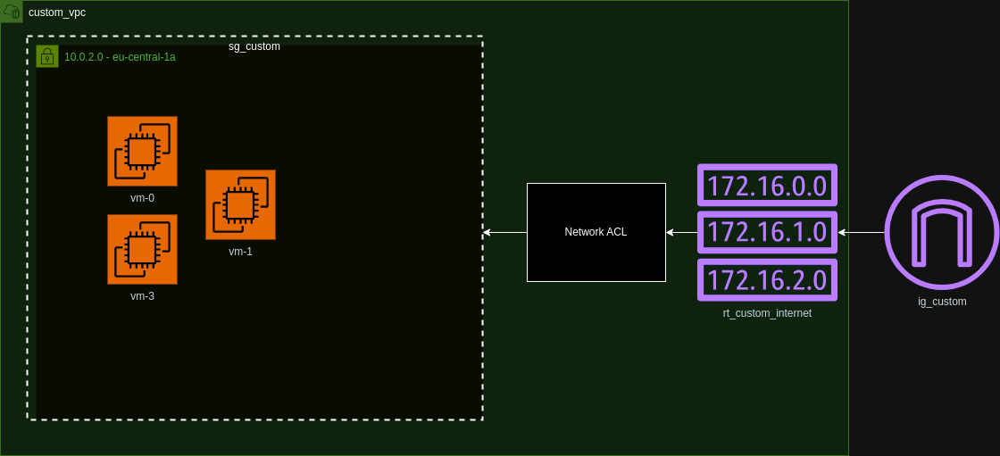

# AWS VPC EC2 RouteTable Terraform PoC



This project is designed to set up and manage a basic AWS infrastructure using Terraform. The infrastructure includes components such as a Virtual Private Cloud (VPC), Subnets, Route Tables, Security Groups, Internet Gateways, and EC2 instances.

## Prerequisites

Before running the project, ensure that you have the following installed:

- Terraform v1.8.2 or higher
- AWS CLI configured with appropriate credentials
- Access to an AWS account

## Setup Instructions

1. **Clone the Repository**


2. **Initialize Terraform**

   Initialize Terraform to download necessary providers and set up the environment:

   ```bash
   terraform init
   ```

3. **Review and Modify Variables**

   Review the Terraform configuration files and modify any variables as needed to match your environment. This may include:

   - VPC CIDR blocks
   - Subnet CIDR blocks
   - Instance types
   - AMI IDs

4. **Plan the Infrastructure**

   Run a Terraform plan to see what changes will be made:

   ```bash
   terraform plan
   ```

5. **Apply the Infrastructure**

   Apply the changes to set up the infrastructure on AWS:

   ```bash
   terraform apply
   ```

6. **Verify the Setup**

   Once the apply is complete, verify that the resources have been created in the AWS Management Console.

## Cleaning Up

To destroy the infrastructure and avoid incurring charges:

```bash
terraform destroy
```

## Troubleshooting

- Ensure that your AWS credentials are correctly configured and have the necessary permissions.
- Check that the AWS region specified in the configuration files matches your desired region.

## License

This project is open-source and available under the [MIT License](LICENSE).